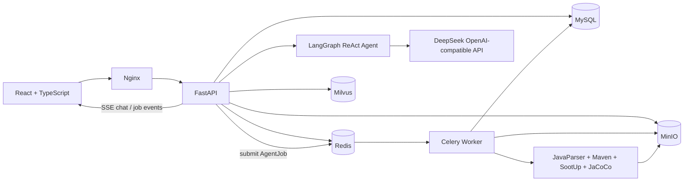
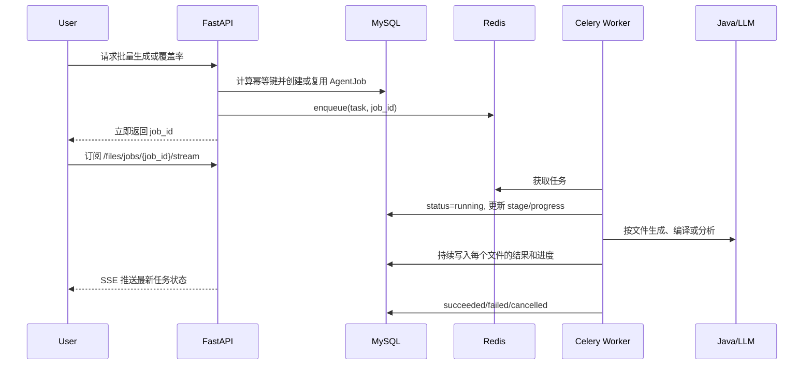

# A3 Java 测试生成 Agent：技术实现、演化与面试说明

> 本文对应仓库中的 `Agent_App`。它不是一个只演示一次调用的聊天 Demo，而是一个可以部署的 Java 测试工程 Agent：用户上传 Maven/Gradle Java 项目 ZIP，在网页中对话、查看源码与测试、让 Agent 生成或修复 JUnit 测试、执行 Maven 和 JaCoCo，并以异步任务和实时进度的方式返回结果。

## 1. 项目定位

### 1.1 一句话介绍

我将原本以固定脚本串联的 Java 单元测试生成流程，演化成了一个可部署的 Agent 平台。前端使用 React 提供多会话对话和项目工作区，后端使用 FastAPI、LangGraph、Celery、MySQL、Redis、MinIO 和 Milvus，支持项目上传、结构化代码分析、工具自主调用、批量测试生成、JaCoCo 覆盖率分析、低覆盖率修复、任务取消、历史会话和文件去重。

### 1.2 45 秒面试回答

这个项目解决的是 LLM 生成 Java 单元测试时的三个核心问题：第一，模型需要理解真实项目的依赖和代码结构，不能只拿一个孤立 Java 文件；第二，生成、编译、覆盖率分析都属于长耗时且有副作用的操作，不能阻塞聊天接口；第三，用户意图不能依赖关键词硬编码，否则“修复低覆盖率”很容易被误判为普通聊天。

因此我采用 LangGraph 负责多轮工具调用和状态化 Agent 编排，FastAPI 提供 SSE 对话流，Celery 加 Redis 处理批量生成、覆盖率和修复任务，MySQL 保存业务状态和会话，MinIO 保存 ZIP、源码与产物。上传的项目先使用 JavaParser 提取 AST 上下文，再在可编译时使用 SootUp 提取字节码和 Jimple。长任务通过 `AgentJob` 持久化真实进度和幂等键，前端可以切换到其他会话而不中断后台运行。

## 2. 总体架构



架构中有两个不同的执行平面：

1. **交互平面**：浏览器、FastAPI、LangGraph 和 LLM。它负责理解问题、决定是否需要工具、流式显示回复，以及快速返回 `job_id`。
2. **作业平面**：Celery Worker、Maven、SootUp、JaCoCo。它负责真正消耗时间和计算资源的工作，并持续写回可恢复的任务状态。

这个划分是部署可用版本和同步 Demo 的分水岭。用户关闭当前页面、切换会话，甚至 API 服务重启后，已持久化的任务状态仍可查询和恢复展示。

## 3. 技术栈与职责

| 层次 | 技术 | 解决的问题 | 选择理由 |
|---|---|---|---|
| 前端 | React + TypeScript + Vite | 多会话聊天、文件工作区、弹窗预览、任务进度 | 组件状态和并发 SSE 订阅更易拆分；TypeScript 可以约束复杂 API 返回值。 |
| Web 服务 | FastAPI + Pydantic + SQLAlchemy | REST API、SSE、鉴权、数据建模 | 异步接口支持好，Python 又能直接集成 LLM、Celery 和 Java 子进程。 |
| Agent 编排 | LangGraph | 多轮模型-工具循环、工具状态、回合上限 | 比手写 `while tool_call` 更容易限制循环、记录工具调用并扩展状态图。 |
| LLM 接入 | OpenAI-compatible Client + DeepSeek | 意图理解、回答、生成与修复测试 | 使用兼容层避免把业务绑定到单一模型供应商。 |
| 异步任务 | Celery + Redis | 批量生成、编译、JaCoCo、修复、取消 | HTTP 请求不适合承载几十秒至数分钟任务；Celery 支持独立 Worker、重试和横向扩容。 |
| 关系数据 | MySQL 8 | 用户、会话、消息、文件元数据、任务、产物 | 这些数据需要事务、一致性、关联查询和唯一约束。 |
| 对象存储 | MinIO | 原始 ZIP、项目快照、生成测试、压缩包 | 大文件不应该塞进关系数据库；MinIO 兼容 S3，后续可迁移云对象存储。 |
| 缓存/队列 | Redis | Celery broker、result backend、短期任务调度 | 简单稳定，和 Celery 集成成熟。 |
| 向量存储 | Milvus | 代码/文档知识库的检索预留 | 适合大量向量相似度检索；当前不强行让所有对话走 RAG。 |
| Java 静态分析 | JavaParser | 从 `.java` AST 提取类、方法、字段、修饰符、源码片段 | 无需先成功编译，上传后即可快速获得可靠源码上下文。 |
| 字节码分析 | Maven/Gradle + SootUp | 编译项目、获得 FQN、方法签名、Jimple | Jimple 是字节码层中间表示，适合进一步分析控制流和路径。 |
| 覆盖率 | Maven Surefire + JaCoCo | 执行测试并解析指令、分支、行、方法、类、复杂度覆盖率 | 是 Java 生态事实标准，比只展示行覆盖率更完整。 |
| 部署 | Docker Compose + Nginx | 本地/服务器一致部署、多服务编排、上传大小限制 | 将前端、API、Worker、数据库与中间件统一管理。 |

## 4. 从 Workflow 到 Agent：技术选型如何演化

### 4.1 初始方案：固定 Workflow

原始任务可以抽象为：读取 Java 文件 -> 拼 Prompt -> 调用模型 -> 保存 JUnit 文件。这个流程在输入单一、目标明确时简单可靠，且成本低。

但是当用户开始提出以下问题时，固定流程就不够了：

- “当前类的 FQN、方法签名或 Jimple Code 是什么？”
- “为什么刚生成的测试编译不过？”
- “运行当前测试的覆盖率，并修复低覆盖率分支。”
- “哪些是生产源码，哪些是测试源码？”
- “只给我选中的文件生成测试，后台继续跑，我先去其他会话。”

这些请求不再是单一路径。它们可能是查询，也可能需要依次执行分析、生成、编译、诊断、修复和再验证。因此项目不能用一个关键词路由后把能力锁死，而应允许模型基于当前上下文选择合适工具。

### 4.2 当前方案：LangGraph ReAct Agent

核心实现位于 `Agent_App/backend/app/services/react_tool_agent.py`：

1. 使用 `StateGraph(MessagesState)` 保存消息状态。
2. 将领域能力封装成有明确输入输出的工具。
3. 模型先返回回答或工具调用。
4. `ToolNode` 执行工具，将结构化结果写回对话状态。
5. 图根据“是否还有工具调用”进入下一轮或结束。

Agent 使用的不是一个万能 shell 工具，而是受限的业务工具，例如：

- `list_files`、`analyze_file`、`read_code_context`：查看工作区和代码结构。
- `list_artifacts`、`read_artifact`、`explain_artifact`：检查已生成测试。
- `submit_batch_generate_tests`：提交批量生成任务。
- `start_coverage_job`：提交覆盖率任务。
- `start_low_coverage_repair_job`：提交覆盖率驱动的修复任务。
- `read_memories`、`remember`：管理稳定偏好和项目长期信息。

### 4.3 为什么不继续依赖关键词或“标准化输入”

早期版本尝试把口语化输入预编码为 `chat`、`generate`、`coverage` 等意图。这种方式对少量固定命令有效，但会带来两个严重问题：

1. **语义被过早压缩**：`“覆盖率很低，修复一下”` 被错分为 `chat` 后，后面即使模型理解了“修复”，也没有修复工具权限。
2. **硬规则和真实上下文冲突**：同一句“生成测试”可能表示解释生成策略、提交当前文件任务，或只想规划批量范围。关键词无法判断对象、范围和副作用。

现在的原则是：

- 标准化只做轻量保护，例如识别是否是读取、是否有明确执行动词、是否要求选择范围。
- **不使用标准化结果作为工具权限白名单**。
- 由 LangGraph 中的模型结合会话、当前文件、项目状态和工具描述作决策。
- 对高副作用操作保留硬约束，例如批量工作必须提交后台作业、没有明确目标时不得全项目修改、没有项目快照时不能运行 Maven。

这是一种“模型负责语义决策，系统负责安全边界”的分层。模型可以理解模糊表达，但不能越过任务范围、权限和资源限制。

### 4.4 为什么选择 LangGraph，而不是只用 LangChain 或直接调 API

| 方案 | 适用场景 | 本项目的结论 |
|---|---|---|
| 直接调用 LLM API | 单次总结、单次测试生成、无工具循环 | 在内部的测试源码生成 Prompt 中仍然使用，最简单、延迟最低。 |
| LangChain | Prompt 模板、文档加载、检索链、简单工具封装 | 可作为组件层使用，但不能单独解决复杂状态和长任务恢复。 |
| LangGraph | 多轮工具调用、状态图、路由、可控循环、可中断工作流 | 用在 Agent 对话编排层，最符合“问题 -> 多次工具 -> 最终解释”的需求。 |
| Celery | 可靠后台任务，不负责模型推理路由 | 和 LangGraph 是互补关系。LangGraph 决定提交什么，Celery 真正执行耗时操作。 |

一句面试表达：**LLM API 负责一次生成，LangGraph 负责 Agent 的决策过程，Celery 负责可恢复的长耗时执行。它们不是互斥替代关系。**

## 5. 从孤立 Java 文件到真实项目 ZIP

### 5.1 遇到的问题

只上传一个 Java 文件时，文件经常包含项目内或第三方依赖：

```java
import org.apache.commons.codec.EncoderException;
import org.apache.commons.codec.binary.StringUtils;
```

如果后端仅把用户上传的单文件与生成的测试放入临时目录，Maven 无法解析项目模块、`pom.xml`、资源文件和依赖图。结果是测试看起来生成成功，但编译、执行和 JaCoCo 全部失败。

### 5.2 演化方案

1. **单文件上传**：保留，用于轻量代码阅读和最小场景测试生成。
2. **文件夹上传**：浏览器上传数百文件的体验很差，也容易遗漏隐藏文件、构建文件和目录结构。
3. **项目 ZIP 上传**：最终采用。用户上传一个 ZIP，后端安全解压并保留原目录结构，识别 Maven/Gradle 项目。
4. **项目内文件视图**：ZIP 不是黑箱。后端解析每个 Java 文件，前端按“生产源码”和“测试源码”展示，允许选择单个或多个生产文件操作。

### 5.3 为什么 ZIP 是更合理的部署接口

- 一个上传请求即可保留项目完整结构。
- 构建文件、资源、模块关系和内部依赖可以一起进入隔离工作目录。
- 更容易做 SHA-256 去重和对象存储。
- 提交给后台 Worker 时使用项目快照，避免用户后续上传新版本影响旧任务。

### 5.4 安全处理

ZIP 上传必须检查：

- 文件后缀和真实压缩格式。
- 解压路径是否发生 Zip Slip，例如 `../../outside`。
- 解压后文件数、压缩比和总大小，防止 ZIP bomb。
- 可执行文件、符号链接和不需要的构建产物。
- Maven/Gradle 子进程的超时、内存、CPU 和网络边界。

项目当前已围绕项目快照执行，但生产环境还应进一步把构建执行放入受限容器或 Kubernetes Job，避免不可信构建脚本直接在 Worker 主机运行。

## 6. JavaParser、SootUp 与 Jimple：为什么两者都需要

### 6.1 JavaParser 解决源码层问题

JavaParser 能直接解析源代码 AST，即使整个项目还没有成功编译，也能提取：

- package 和类名，用于生成 FQN。
- 方法声明、参数、返回值、注释和方法源码。
- 字段、构造器、helper 方法、访问修饰符和 `throws`。

这些数据会被存入 `CodeContext`，并成为生成测试 Prompt 的结构化上下文。相比把整份 Java 文件塞给模型，它有三个好处：Token 更可控、信息更准确、调用工具时可以只读取需要的字段。

### 6.2 SootUp 解决字节码层问题

Jimple 不是 JavaParser 的输出，而是基于 `.class` 字节码的中间表示。因此流程必须是：

```text
项目快照 -> Maven/Gradle compile -> .class 文件 -> SootUp -> Jimple / 字节码级 FQN / 方法信息
```

Jimple 接近三地址码，控制流和临时变量表达更显式。它适合：

- 解释某方法内部真实控制路径。
- 辅助识别异常分支、空值路径和边界路径。
- 为后续路径覆盖、变异测试或静态污点分析预留接口。

### 6.3 为什么有时没有 Jimple

没有 Jimple 不等于“Agent 没有分析”。常见原因是 Maven 编译失败、项目 JDK 版本不兼容、依赖未下载完成、模块选择错误或构建超时。此时系统仍返回 JavaParser 的源码级上下文，但必须清晰标记来源为 `uploaded_source_static_analysis`，而不能假装 Jimple 存在。

这是一个面试里很重要的诚实性设计：**不同质量的分析结果必须携带来源与可用字段，让 Agent 和用户知道结论的可信边界。**

## 7. 原始 Prompt 如何保留并接入 Agent

将项目包装为 Agent 后，原有 Prompt 不能被丢弃。原流程积累的测试生成 Prompt 包含了 JUnit 版本、输出格式、断言风格、上下文结构等关键知识。

当前设计的分工是：

- `prompt_service.py` 继续读取并渲染原 `Data/Prompts/prompt_template` 中的模板。
- `agent_service.py` 将 JavaParser/SootUp 提取的结构化上下文注入生成 Prompt。
- LangGraph 只负责判断何时调用“生成测试”工具、对哪个文件调用、是否改为后台批处理，以及如何向用户解释结果。

因此 Agent 没有取代原测试生成逻辑，而是把原逻辑封装为可组合工具。面试中可以表述为：**复用领域 Prompt 作为专用能力层，把 Agent 用作编排层，避免用通用聊天 Prompt 稀释原本的测试工程规则。**

## 8. 为什么必须引入 Celery、AgentJob 与真实进度

### 8.1 同步 HTTP 的问题

一次批量测试生成可能包含：读取几十个文件、调用数十次 LLM、写测试、执行 Maven、运行 JaCoCo、解析 XML 报告。同步请求会导致：

- Nginx、浏览器或负载均衡器超时。
- 用户无法切换对话，否则连接断开。
- 无法可靠取消。
- 服务进程重启后不知道任务做到第几个文件。
- 100 个用户同时点击时，API Worker 被编译任务占满。

### 8.2 AgentJob 的数据模型

`AgentJob` 是一个持久化作业记录，保存：

- `kind`：批量生成、批量覆盖率、批量修复等。
- `status`：queued、running、succeeded、failed、cancelled。
- `progress`、`total`、`current_item`：真实进度，而不是前端假进度条。
- `stage`、`message`：如“分析源码”“调用模型”“Maven 编译”“解析 JaCoCo”。
- `result_json`、`error_message`：任务结果和失败诊断。
- `cancel_requested`：取消请求标志。
- `idempotency_key`：幂等控制。

### 8.3 提交和执行流程



### 8.4 取消为何不是“立刻杀进程”

前端点击取消后，API 将 `cancel_requested=true` 写入数据库。Worker 在每个文件或每个阶段的安全点检查这个标记，并停止后续工作。这样避免把数据库、对象存储和正在写入的产物留在不一致状态。

对于正在执行的 Maven 子进程，还应实现进程组终止和清理机制。当前安全点取消已经解决“继续消耗后续 token 和批量资源”的主要问题；生产增强方向是容器级超时和主动子进程终止。

### 8.5 SSE 和 WebSocket 的取舍

本项目对话和作业状态主要是服务端单向推送，客户端上传、发送消息、取消任务都可以通过普通 HTTP 完成。因此 SSE 更合适：

- 协议简单，浏览器原生支持，容易走 Nginx。
- 适合 LLM token 流和任务状态流。
- 可按 `conversation_id` 或 `job_id` 独立订阅，支持用户切换会话。

如果未来需要多人协作编辑、共享光标或客户端高频上报，则再引入 WebSocket。不能因为“实时”就默认选择 WebSocket。

## 9. 任务幂等键与文件去重不是一回事

这两个概念经常被混淆。

### 9.1 内容去重

上传 ZIP 或源码时，系统计算 SHA-256。若相同内容已经存在，对象存储只保留一份实体，业务记录引用同一对象。这解决的是存储浪费和重复上传。

### 9.2 任务幂等

任务幂等键解决的是重复点击、网络重试或客户端超时重发。例如：

```text
user_id + job_kind + project_snapshot_sha256 + file_ids + parameters
    -> SHA-256 idempotency_key
```

在 MySQL 上为 `(user_id, idempotency_key)` 建唯一索引。相同用户对相同项目快照、相同文件集合和相同参数重复请求时：

- 正在运行或已成功：直接返回原 `AgentJob`。
- 已失败或已取消：复用记录并重新入队，或通过 `force=true` 创建新任务。

因此正确回答是：**有任务幂等键不代表不需要文件去重。一个防止重复执行，一个防止重复存储，层级不同。**

## 10. JaCoCo 覆盖率：从“百分比”到可诊断报告

### 10.1 为什么只展示行覆盖率不够

行覆盖率高不代表条件判断已经覆盖。例如一个 `if (value == null || value.isEmpty())` 可能只运行了一个分支，但对应源代码行仍显示已执行。因此页面需要展示 JaCoCo 的完整指标：

- Instruction：字节码指令覆盖率。
- Branch：条件分支覆盖率。
- Line：代码行覆盖率。
- Method：方法覆盖率。
- Class：类覆盖率。
- Complexity：圈复杂度覆盖率。

每个指标都展示 `covered / missed / total / percentage`，并用 JaCoCo 风格的红绿条显示。这样用户能看出是“整个方法没执行”，还是“方法执行了但异常分支没覆盖”。

### 10.2 执行流程

1. 从项目快照复制一个临时运行目录。
2. 将生成的测试放入正确的 `src/test/java` 目录和包路径。
3. 运行 Maven/Surefire 和 JaCoCo agent。
4. 读取 `jacoco.exec` 与 XML/HTML 报告。
5. 依据测试类对应的源类和 FQN 定位目标 class。
6. 将解析后的多维指标写入作业结果和 Artifact 元数据。

### 10.3 “目标类行覆盖率未识别”的原因与修复思路

这不代表 JaCoCo 没有运行，通常是报告中的类名与生成测试推断的 FQN 不匹配。常见原因有：内部类使用 `$`、源码包路径和 Maven 模块根目录不同、测试名称并不等于源类名称、报告只输出 aggregate 节点。

正确修复不是显示 `0%`，而是：

- 用 `CodeContext.fqn` 和真实 class 文件路径定位。
- 记录匹配策略与“未匹配原因”。
- 在无法定位时展示项目级指标，同时明确目标类指标不可用。
- 将目标源码相对路径、模块路径和 FQN 一起传入覆盖率工具。

### 10.4 为什么会出现 Maven 编译超时或 JDK 版本错误

用户上传的是历史项目，`pom.xml` 可能设置 `source=6`，而 Docker 中是新 JDK。新 JDK 已不再支持 Java 6 编译目标。编译超时也可能是首次下载依赖、插件执行 SCM 命令、项目测试过大或网络受限。

系统应当把失败阶段细分为 `maven_compile`、`maven_test`、`jacoco_report`，保留截断日志、耗时和建议，而不是只说“覆盖率失败”。生产方案还需要：Maven 仓库缓存、JDK 工具链矩阵、离线依赖策略、模块选择和每阶段独立超时。

## 11. 低覆盖率修复为何效果可能差，以及如何改进

低覆盖率修复不是简单“再让模型写一次测试”。效果差通常来自四类原因：

1. 生成时没有拿到 JaCoCo 的未覆盖行、未覆盖分支和异常信息。
2. 没有区分测试编译失败、运行失败、断言错误和覆盖率不足。
3. 上下文只包含当前方法，缺少构造器、helper、字段和依赖初始化方式。
4. 修复后没有再次运行覆盖率闭环验证。

当前修复设计是一个闭环：

```text
run_coverage -> diagnose_artifact -> repair_artifact -> run_coverage
```

进一步演化建议：

- 把 JaCoCo XML 中未覆盖的行和分支定位到具体方法。
- 修复 Prompt 明确目标，例如“覆盖 `null` 与 empty 两个分支，不改生产代码”。
- 一次只提出少量候选用例，并逐轮验证，而不是无约束重写全部测试。
- 对低价值 getter/setter、不可达代码、外部环境依赖代码允许用户标记排除。
- 保存每一版 Artifact 和覆盖率快照，用户可以比较和回滚。

## 12. 数据模型、会话和记忆

主要实体包括：

| 实体 | 作用 |
|---|---|
| `User` | 登录用户和数据隔离边界。 |
| `Conversation` | 对话标题、创建时间、更新时间。 |
| `Message` | 用户消息、模型消息、工具调用摘要、点赞/点踩。 |
| `UploadedFile` | 单文件或 ZIP 中解析出的 Java 文件元数据、内容哈希、来源项目。 |
| `CodeContext` | JavaParser/SootUp 提取的 FQN、方法源码、字段、Jimple 等。 |
| `GeneratedArtifact` | 生成测试、修复版本、文件路径、Prompt 哈希、覆盖率结果。 |
| `AgentJob` | 长任务状态、进度、取消、幂等键、结果。 |
| `AgentMemory` | 稳定偏好和长期项目事实。 |
| `MessageFeedback` | 对回答的点赞/点踩和反馈内容。 |

### 12.1 会话记忆和长期记忆的边界

- **会话记忆**：从 MySQL 读取当前会话消息，让模型理解“当前文件”“刚才的覆盖率结果”。
- **长期记忆**：只保存稳定且明确的信息，例如“该用户默认使用 JUnit 4”“项目使用 Java 8”“不要生成某些目录”。
- **不应自动记忆的内容**：一次性报错、随机聊天内容、未经确认的猜测。

“自主记忆”不是模型把所有内容都写库。正确做法是提取候选记忆，按类型、置信度、作用域去重，并让用户能查看、编辑或删除。

## 13. 前端交互设计的关键点

### 13.1 多会话并行

页面不应因为一个会话正在生成而禁用其他会话。实现上：

- 任务绑定 `conversation_id` 与 `job_id`，而不是绑定当前 React 页面组件。
- 每个会话的消息列表和运行状态独立保存。
- SSE 订阅按对话或作业维度管理，切换视图时不取消后台任务。
- 用户回到原会话时根据 `AgentJob` 状态恢复进度和结果。

### 13.2 文件区分与可见性

ZIP 中的 Java 文件必须区分：生产源码、原项目测试源码、Agent 生成测试。前端采用分组和标签，而不是把所有 `.java` 混在一个可滚动列表里。用户在生产源码中选中目标文件，再提交生成或覆盖率任务。

### 13.3 不使用假进度条

进度只能来自 Worker 实际写入的 `current_item / total / stage`。例如：

```text
正在生成 7/63: StringUtils.java
阶段：调用模型并校验测试源码
```

若某一步耗时较长，前端显示当前阶段、已耗时和“可取消”，而不是让一个没有依据的 92% 进度条长时间不动。

## 14. 部署架构与 Docker 的作用

`docker-compose.yml` 编排：前端、Nginx、FastAPI backend、Celery worker、MySQL、Redis、MinIO、Milvus 和其依赖服务。

Docker 在这里不是“为了使用 Docker 而使用”，而是解决实际一致性问题：

- API 和 Worker 需要相同的 Python 依赖、Java/Maven 环境和项目代码。
- JaCoCo、SootUp、Maven 在不同开发电脑上容易因 JDK 版本产生不同结果。
- MySQL、Redis、MinIO、Milvus 的连接地址可以用服务名固定。
- 用户上传上限需要在 Nginx 和后端同时配置。

但 Docker Compose 仍是单机部署方案。更大规模时可演化为：对象存储使用云 S3，Celery Worker 独立自动扩容，构建执行转成短生命周期容器或 Kubernetes Job，MySQL/Redis 使用托管服务。

## 15. 项目当前的边界和下一阶段改进

### 15.1 已经解决的关键问题

- 项目 ZIP 与单文件并存，支持真实依赖环境下测试。
- JavaParser 源码分析和 SootUp/Jimple 字节码分析的双层上下文。
- Prompt 复用，而不是用聊天 Prompt 替换测试工程 Prompt。
- LangGraph 工具调用代替高风险的关键词权限锁定。
- 批量生成、批量覆盖率、批量修复转入 Celery。
- `AgentJob` 支持真实进度、结果、取消和查询。
- 文件 SHA 去重和任务幂等键各自处理不同的重复问题。
- SSE 支持 LLM 输出和后台任务状态持续显示。
- MySQL、MinIO、Redis、Milvus 已容器化集成。

### 15.2 仍然需要继续建设的部分

1. **构建安全隔离**：将不可信项目的 Maven/Gradle 执行放在受限容器，限制网络、CPU、内存和文件系统。
2. **更强的任务恢复**：Worker 异常退出后，增加运行中任务的超时检测、重新调度和死信队列。
3. **JDK 工具链兼容性**：按项目 `pom.xml` 自动选择 JDK 8/11/17，避免历史项目在新 JDK 下编译失败。
4. **覆盖率定位精度**：完善多模块、内部类、聚合报告下的目标类匹配。
5. **修复质量闭环**：基于未覆盖分支精确修复，保存版本对比，必要时引入变异测试评价。
6. **知识库真正启用**：当前 Milvus 是预留能力。只有当积累了团队测试规范、常见构建错误、项目文档和历史高质量测试后，再启用带权限与引用的 RAG。
7. **观测性**：接入结构化日志、Prometheus 指标、链路 ID、任务耗时分布和 LLM 成本统计。

## 16. 高频面试问答

### Q1：这真的是 Agent 项目吗？

是，但不是因为它调用了 LLM。它具备 Agent 的三个条件：模型可以基于用户问题和项目上下文自主选择受限工具；工具结果会回到下一轮推理；系统有持久化状态、记忆、任务和可恢复的执行边界。与此同时，测试生成这一核心能力仍保留确定性的领域 Workflow，这是合理的混合架构。

### Q2：为什么不全用 Agent，原来的 Workflow 不是更稳定吗？

固定 Workflow 更适合“已知输入、已知路径、已知输出”。Agent 解决的是用户意图多样和工具组合问题。我的设计没有把确定性流程 LLM 化，而是让 Agent 决定调用哪个经过约束的 Workflow，例如提交批量生成、读取 Jimple 或启动覆盖率任务。

### Q3：为什么要把 LangGraph 和 Celery 一起用？

LangGraph 解决模型推理和工具编排，Celery 解决长任务的排队、执行、取消和扩容。让 LangGraph 直接运行 Maven 会阻塞聊天、难以取消，也无法支撑并发。让 Celery 决定用户意图又会把语义理解写死。因此二者分层协作。

### Q4：为什么选择 SSE 而不是 WebSocket？

聊天 token 和任务状态是服务端到客户端单向流，客户端反向动作只是发送消息、上传和取消，普通 HTTP 足够。SSE 更轻量，部署在 Nginx 后更简单，还能按会话或任务独立订阅。只有多人协作、高频双向事件时才有必要引入 WebSocket。

### Q5：如何避免 Agent 重复调用同一个工具，甚至陷入循环？

工具有清晰的 schema 和结果摘要，LangGraph 保存每轮状态；系统设置最大工具回合；对昂贵操作只允许提交后台作业；批量工具不再暴露同步的“逐文件生成”接口；每个任务有幂等键。这样从提示、编排和存储三个层面同时防止循环和重复消耗。

### Q6：任务幂等和文件去重有什么区别？

文件去重按内容哈希，节约存储。任务幂等按用户、项目快照、文件集合和参数构造键，防止相同操作重复运行。两者要一起做，不能互相替代。

### Q7：Milvus 现在有没有真正发挥作用？

基础设施已接入，但没有强制所有问题都走向量检索。对当前文件的 FQN、Jimple 和方法源码，应优先通过精确数据库查询或工具获取。Milvus 适合检索大规模规范、历史修复案例、项目文档和跨项目经验。先明确知识源和评估指标，再启用 RAG，避免为了“有向量库”制造幻觉。

### Q8：如何处理用户上传项目执行构建的安全风险？

当前使用临时项目快照、超时和 Worker 边界控制。生产环境还要把构建运行在短生命周期隔离容器中，最小化权限，禁用或限制网络，限制 CPU/内存/磁盘，白名单 Maven 参数，并及时回收目录。不能把用户的 `pom.xml` 当作完全可信代码。

## 17. 代码入口与本地验证

| 目标 | 主要入口 |
|---|---|
| Agent 图和工具循环 | `Agent_App/backend/app/services/react_tool_agent.py` |
| 领域工具与测试生成 | `Agent_App/backend/app/services/agent_service.py` |
| 技能说明 | `Agent_App/backend/app/services/skills.py` |
| 任务幂等与提交 | `Agent_App/backend/app/services/job_service.py` |
| Celery 任务 | `Agent_App/backend/app/tasks/agent_jobs.py` |
| JavaParser/SootUp 上下文提取 | `Agent_App/backend/app/tasks/context_extraction.py` |
| 文件、作业、SSE 路由 | `Agent_App/backend/app/routers/files.py` |
| 数据模型 | `Agent_App/backend/app/models.py` |
| React 聊天和任务 UI | `Agent_App/frontend/src/main.tsx` |
| HTTP/SSE API 封装 | `Agent_App/frontend/src/api.ts` |
| 容器编排 | `Agent_App/docker-compose.yml` |

常用命令：

```powershell
docker compose -f Agent_App/docker-compose.yml up -d --build
docker compose -f Agent_App/docker-compose.yml ps
docker compose -f Agent_App/docker-compose.yml logs --tail=100 backend worker
```

开发环境入口通常为：

- 前端：`http://127.0.0.1:8080/`
- FastAPI 文档：`http://127.0.0.1:8000/docs`

## 18. 面试结束时可以主动强调的亮点

这个项目最核心的不是“调用 DeepSeek 生成测试”，而是把一次 LLM 能力做成了可以被真实用户使用和运营的系统：有项目级上下文、有安全边界、有异步队列、有任务幂等、有文件去重、有流式反馈、有失败诊断，也保留了将静态规则和领域 Prompt 放在确定性流程中的工程判断。下一步重点会是构建沙箱、JDK 工具链、覆盖率定位精度和修复质量闭环，而不是继续堆叠更多 Agent 框架。
