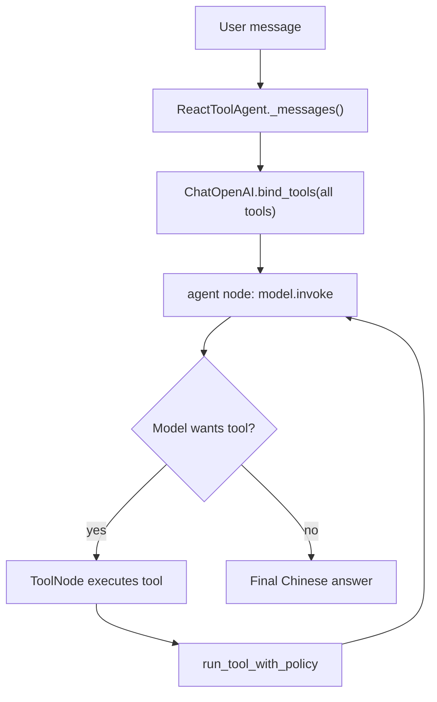

# 意图路由与工具调度演化

## 一句话结论

当前项目的主路径已经不是“先做意图分类，再按 skill 白名单砍工具”。

现在的主路径是：

```text
用户原话
 -> LangGraph ReAct agent
 -> LLM 在可用工具中自主判断是否调用工具
 -> run_tool_with_policy 做安全边界和调用次数控制
 -> 工具结果回到 LLM
 -> 输出中文回答
```

更准确地说：

```text
现在：ReAct 自主选工具 + policy 层兜底
过去：关键词/语义路由 + skill 工具白名单
```

旧路由没有完全消失，但它现在主要作为 fallback：

```text
没有 OPENAI_API_KEY
LangGraph agent 执行失败
需要本地 scripted fallback
```

## 原本的问题

原本的设计可以概括为：

```text
关键词路由 + skill 白名单
```

执行链路大概是：

```text
用户消息
 -> normalize_user_request / route_user_request
 -> 得到 intent / mode / skill_id
 -> 根据 skill_id 过滤工具列表
 -> LLM 只能看到该 skill 允许的工具
 -> LLM 调工具或直接回答
```

这个方案的问题是：**路由结果决定了工具权限**。

也就是说，前面只要误判一次，后面的 Agent 就可能失能。

例如：

```text
用户：这个生成的测试为什么编译不过？

如果被误判为 chat：
 -> skill = general_chat
 -> 可用工具只剩 list_skills / read_memories
 -> Agent 看不到 compile_artifact / diagnose_artifact / repair_artifact
 -> 即使模型想诊断，也没有工具可用
```

再比如：

```text
用户：覆盖率太低，帮我补一下

如果被误判为普通 repair_latest：
 -> 可能走编译修复
 -> 没有先测 baseline coverage
 -> 也不会验证覆盖率是否真的提高
```

所以旧方案最脆弱的点是：

```text
意图分类错误 = 工具权限错误 = Agent 能力被提前砍掉
```

## 当前主路径

当前主路径在 `AgentService.llm_chat()` 里。

有 OpenAI API key 时，它不会先调用 `route_user_request()` 来决定工具权限，而是构造一个 `ReactToolAgent`：

```text
llm_chat()
 -> react_request_metadata()
 -> ReactToolAgent(...).run()
```

`react_request_metadata()` 只记录审计信息：

```text
intent = agentic_react
mode = agent
route_source = langgraph_react
allowed_tools = list(self.tools())
```

注意这里的关键点：

```text
metadata 不决定工具权限
metadata 只用于 memory / audit
```

真正工具选择交给 ReAct loop。

## ReactToolAgent 怎么工作

`ReactToolAgent` 做了三件事：

```text
1. 把后端业务工具包装成 StructuredTool
2. 把工具绑定给 ChatOpenAI
3. 用 LangGraph 构建 agent -> tools -> agent 循环
```

流程是：



系统提示里明确写了两条关键规则：

```text
The user's latest original message is the task.
Do not rely on a separate intent classifier.
```

以及：

```text
Skills are workflow knowledge and audit labels, not tool permissions.
```

也就是说，现在的设计故意避免：

```text
一个 intent label 决定工具权限
```

## Skill 现在是什么角色

当前项目里 `skills.py` 仍然存在，而且很有价值。

它现在主要承担：

```text
能力目录
风险标签
审计标签
UI/文档说明
工具归属说明
fallback 路由参考
```

例如：

```text
general_chat
code_understanding
artifact_management
test_generation
coverage_analysis
coverage_repair
test_repair
memory
```

每个 skill 仍然描述：

```text
tools
intents
read_only
side_effecting
max_steps
```

但在当前 ReAct 主路径中，skill 不再是硬白名单。

更准确地说：

```text
过去：skill = 工具权限边界
现在：skill = 工作流知识 + 审计标签
```

## 当前真正的安全边界在哪里

当前真正的安全边界不在 skill 白名单，而在 `run_tool_with_policy()`。

它做几类控制。

### 1. 参数补全

如果模型调用工具时没有传 `file_id` 或 `artifact_id`，后端会根据当前会话上下文补齐：

```text
analyze_file / read_code_context / generate_tests / list_artifacts
 -> 自动补 active file_id

read_artifact / explain_artifact / compile_artifact / diagnose_artifact / repair_artifact / run_coverage
 -> 自动补 latest artifact_id
```

这让模型不需要知道所有内部 ID 细节。

### 2. 重复调用拦截

同一轮里，如果相同工具用相同参数重复调用，会被拦截：

```text
seen_calls
tool_call_key(name, args)
```

目的：

```text
避免循环读同一个资源
避免重复生成
避免工具输出污染上下文
```

### 3. 每轮调用次数上限

每个工具有单轮调用上限：

```text
generate_tests: 1
batch_generate_tests: 1
run_coverage: 1
repair_artifact: 1
repair_low_coverage: 1
remember: 2
```

这比 skill 白名单更稳，因为它不是提前砍掉工具，而是在工具真正被调用时做边界控制。

### 4. 结果压缩和记录

工具结果会经过：

```text
compact_tool_result()
record_tool()
```

这样既能保留审计历史，又避免大段代码、prompt、编译日志撑爆上下文。

## 旧路径现在在哪里

旧路径主要还在这些函数里：

```text
normalize_user_request()
route_user_request()
scripted_chat()
_legacy_llm_chat()
```

它们仍然有用，但定位变了。

现在主要用于：

```text
本地 fallback
无 API key 时的确定性规则响应
LangGraph agent 失败后的降级
部分后台/脚本式流程
```

所以不是简单删除旧路由，而是：

```text
把旧路由从主控制面降级为 fallback / deterministic fallback
```

## 演化过程

从 Git 历史和当前代码看，演化大概分成这些阶段。

### 阶段 1：基础 Agent App

早期重点是把业务工具跑通：

```text
上传 Java
分析文件
生成 JUnit
保存 artifact
编译 / 覆盖率
修复测试
聊天入口
```

这一阶段的核心不是复杂路由，而是把业务能力做出来。

### 阶段 2：加入 skill registry

对应提交：

```text
b285c7d Add agent skill registry
```

这一阶段引入 `skills.py`，把工具按能力分组：

```text
general_chat
workspace_ops
code_understanding
artifact_management
test_generation
coverage_analysis
test_repair
memory
```

收益：

```text
工具归属更清楚
能力目录可展示
读操作 / 写操作风险可标注
不同 intent 可以映射到不同 skill
```

问题：

```text
如果 skill 同时被用作工具白名单，路由误判就会直接砍掉工具能力
```

### 阶段 3：source-aware chat

对应提交：

```text
5640e3c Use skills for source-aware chat
```

这一阶段开始让聊天理解当前文件、选中文件、源码角色等上下文。

目标是让这些问题能正确走读工具：

```text
这个类的 FQN 是什么？
有哪些方法？
哪些是生产源码？
哪些是测试源码？
```

收益：

```text
普通聊天不再盲猜代码事实
可以根据 active_file_id 调 analyze_file / read_code_context
```

风险：

```text
仍然依赖前置 intent / skill 判断
```

### 阶段 4：semantic skills 路由

对应提交：

```text
cebedb1 Route chat with semantic skills
```

这一阶段从纯关键词升级为更语义化的路由。

路由结果包含：

```text
intent
mode
scope
skill_id
canonical
allowed_tools
```

收益：

```text
比关键词路由更准确
能区分 ask / read / act
能把用户原话标准化成 canonical task
```

问题：

```text
仍然是先分类，再决定工具集合
```

所以核心脆弱性还在：

```text
分类错了，工具就没了
```

### 阶段 5：改进语义路由

对应提交：

```text
0f7d703 Improve semantic intent routing
```

这一阶段加强了路由规则和上下文判断，例如：

```text
coverage / JaCoCo 不要误判成 test_generation
generated tests 表示已有 artifact，不是生成新测试
低覆盖率修复应走 repair_low_coverage
工具历史问题应走 list_tool_history
能力询问应走 list_skills
```

收益：

```text
修复了很多具体误判
减少了高风险动作误触发
```

但结构问题仍然存在：

```text
路由仍然是单点决策
一次误判仍可能让 Agent 失能
```

### 阶段 6：切到 LangGraph ReAct 工具循环

对应提交：

```text
7e64aab Use LangGraph ReAct tool loop for chat
```

这是关键转折。

主路径从：

```text
先路由 intent
 -> skill 过滤工具
 -> LLM 在剩余工具中工作
```

变成：

```text
用户原话作为本轮任务
 -> LLM 看到完整工具集合
 -> 自己判断要不要调工具
 -> 后端 policy 控制工具调用边界
```

这解决了原本最关键的问题：

```text
不要让一个脆弱 intent label 提前决定 Agent 有没有工具可用
```

## 新旧方案对比

| 维度 | 旧方案 | 当前方案 |
|---|---|---|
| 主入口 | `route_user_request()` | `ReactToolAgent` |
| 决策方式 | 先分类，再执行 | ReAct 循环中边想边调工具 |
| skill 角色 | 工具白名单 | 能力说明 / 审计标签 |
| 工具可见性 | 按 skill 裁剪 | 主路径给完整工具集合 |
| 错误影响 | intent 误判会让工具消失 | 工具仍可见，模型可自我修正 |
| 安全边界 | 工具白名单 | `run_tool_with_policy()` |
| fallback | 规则/脚本路由 | 仍保留规则/脚本路由 |
| 适合场景 | 简单固定意图 | 多轮自然语言 Agent |

## 当前路由的真实形态

当前并不是“没有路由”，而是路由职责拆开了：

```text
任务理解：
    交给 ReAct LLM 在运行中判断

工具权限：
    不再由 skill 白名单提前裁剪

安全边界：
    由 run_tool_with_policy 控制

审计归因：
    由 skill / ToolCall / memory metadata 记录

降级路径：
    由 normalize_user_request / scripted_chat 处理
```

所以它更像：

```text
软路由 + 硬 policy
```

而不是：

```text
硬路由 + 硬白名单
```

## 为什么现在更稳

旧方案最大的问题是：

```text
理解错一句话，后面就没有工具了
```

当前方案更稳，是因为：

```text
工具不再被前置分类砍掉
模型可以根据工具观察继续判断
重复/危险调用由后端 policy 控制
长任务通过后台 job 工具提交
工具输出被压缩后记录
旧规则路由仍可作为 fallback
```

尤其对这种请求更有帮助：

```text
帮我看看这个类该测什么
生成测试后看看能不能编译
覆盖率低，帮我补一下
解释上次生成的测试
刚刚调用了哪些工具
```

这些请求经常跨越多个 skill。如果硬按一个 skill 白名单裁剪，就容易误伤。

## 还存在的不足

当前方案已经比旧方案稳，但仍有可优化点：

```text
1. tool_schema(skill_id) 参数现在基本不承担过滤职责，容易让读代码的人误会。
2. SkillRegistry.filter_tool_schemas() 还存在，但主路径不用它，建议注释或重命名说明历史用途。
3. normalize_user_request / route_user_request / _legacy_llm_chat 仍保留较多旧逻辑，后续可以明确标记为 fallback-only。
4. 现在主要靠字符截断和调用次数限制，还不是 token budget aware 的上下文管理。
5. ReAct 自主性更强，虽然有 policy，但仍需要持续观察工具误调用案例。
```

## 面试回答版本

可以这样说：

> 这个项目的意图路由经历过一次明显演化。  
> 早期是关键词/规则路由加 skill 白名单：先把用户话术分类成 intent，再根据 intent 找 skill，然后只把该 skill 下的工具暴露给模型。这个方案的问题是前置分类太脆弱，一旦把“编译失败诊断”误判成普通聊天，模型就看不到诊断和修复工具，Agent 会直接失能。  
> 后来我加入了 semantic intent router，能区分 ask/read/act，也能识别 coverage、artifact、source context 等更细的任务，但本质上还是“先路由再裁剪工具”。  
> 当前版本改成 LangGraph ReAct 主路径：用户原话是本轮任务，skill 只作为能力说明和审计标签，不再作为硬工具白名单。模型可以在完整工具集合中选择下一步，真正的安全边界放到后端 `run_tool_with_policy`，包括默认补全 file_id/artifact_id、重复调用拦截、每轮调用次数限制、结果压缩和工具调用记录。  
> 所以现在不是没有路由，而是把路由从“前置硬分类”变成“ReAct 运行时决策 + 后端 policy 约束”。旧的关键词/语义路由仍然保留为无 API key 或 LangGraph 失败时的 fallback。

## 最终总结

这个项目现在的意图路由可以概括成：

```text
原本：
关键词/语义路由 + skill 白名单
一次误判可能砍掉工具权限

现在：
LangGraph ReAct 自主选工具
skill 作为能力目录和审计标签
run_tool_with_policy 负责硬边界
旧路由作为 fallback 保留
```

最关键的设计变化是：

```text
不再让意图分类器决定 Agent 能不能使用某个工具；
而是让 Agent 看到工具，再由后端 policy 控制它能怎么调用。
```
